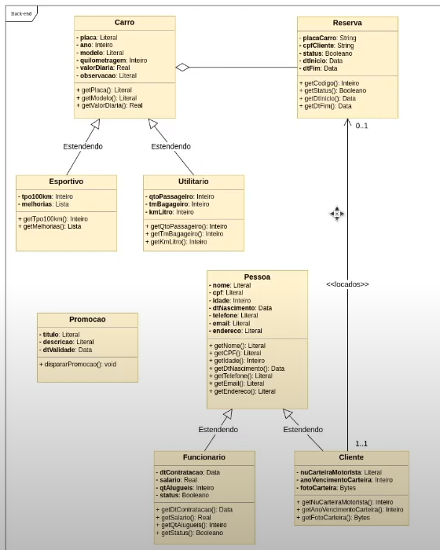

# localiza

Projeto de Node.js e MongoDB

Utilizando
 - Node.js - Tecnologia para execução de js no servidor (backend), é flexível, leve, consegue trabalhar com alta requisição de recursos simultaneamente
 - mongoDB - Banco não relacional, trabalha com BSON (json binário), funciona bem com js e é escalável - https://www.mongodb.com/docs/manual 
 - docker - para utilizar o MongoDB

 Dependencias do projeto
 - express - Framework para desenvolvimento de APIs no Node - https://expressjs.com/pt-br/
 - mongoose - Biblioteca de modelagem de dados de objeto (ODM) baseada em Node.js para MongoDB (camada de abstração)
 - body-parser - Módulo capaz de converter o body da requisição para vários formatos (neste caso, json)
 - nodemon - Ferramenta para auxiliar a observar o codigo durante o desenvolvimento, não precisa para o servidor para ver as mudanças feitas no código

Ferramentas:
- VS Code - IDE de desenvolvimento
- Postman - para testar a API desenvolvida
- NoSQLBooster for MongoDB - interface do MongoDB
- npm - gerenciador de pacotes
- wsl - para usar o docker open source

Roteiro: desenho UML do problema, instalação de dependências, configuração do banco de dados (database) com docker, criação de entidade (models), criação de controle (controllers), criação de rota (routes), exposição da rota (app)

Execução:
Terminal 1
- npm init -y (criar um projeto novo -y para ignorar as perguntas quando)
- no package.json foi trocado o nome do arquivo principal ("main" de index para app)
- npm install [dependencias] (instalar dependencias do projeto)
- npm install
- npm run watch (executar a API via nodemon)

Terminal 2
- wsl (abrir linux no windows)
- docker ps -a (ver os containers existentes)
- docker compose up -d (inicializar ambiente, como o da conexão com o mongo)

